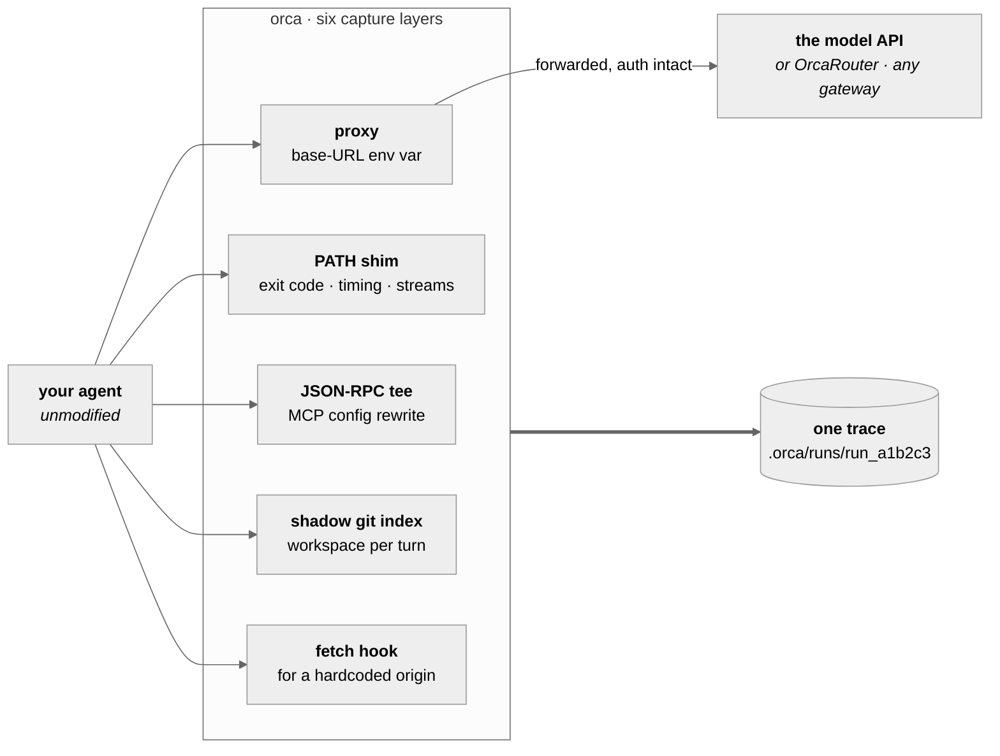
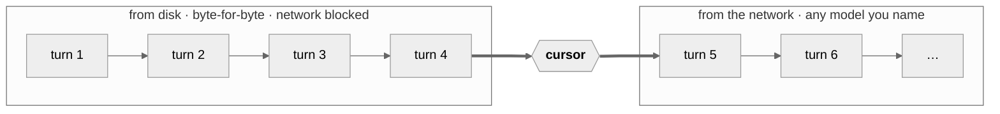

# OrcaReplay
<sub>**English** · [简体中文](docs/i18n/README.zh-CN.md) · [日本語](docs/i18n/README.ja.md) · [한국어](docs/i18n/README.ko.md) · [Deutsch](docs/i18n/README.de.md) · [Français](docs/i18n/README.fr.md) · [Español](docs/i18n/README.es.md) · [العربية](docs/i18n/README.ar.md)</sub>

### Your agent broke something at 2am. Replay it at 9am — exactly, offline, as many times as you like.

Record any coding agent. Reproduce the run byte-for-byte with no model called. Fork it from any step
onto a different model and see who gets it right.

<a href="https://www.orcarouter.ai">
  
</a>

**Built by the team behind [OrcaRouter](https://www.orcarouter.ai)** — one API key and one endpoint
for Claude, GPT, Gemini, Grok, DeepSeek, Qwen and the rest. It is what `orca setup` points at by
default, and what makes `orca compare` a single command instead of four provider accounts.

Find us: [OrcaRouter All model APIs](https://www.orcarouter.ai/models) 

Github Repos: [OrcaCode Review](https://www.orcarouter.ai/code-review) · [OrcaRouter Lite](https://github.com/Continuum-AI-Corp/OrcaRouter-Lite) 

Connect: [X](https://x.com/OrcaRouter) · [Discord](https://discord.com/invite/YEubt8enRA) · [Hugging Face](https://huggingface.co/orcarouter) · [Ollama](https://ollama.com/orcarouter)

<br clear="left">

[](LICENSE)
[](spec/orca-trace-v0.md)
[](#install)
[](#which-agents)
[](docs/good-first-issues.md)
[](https://github.com/hesreallyhim/awesome-claude-code)


<sup>Real output from one session — a Claude Code run recorded, replayed against the recording, then
forked at checkpoint 4 onto two models and graded by `npx tsc --noEmit`. Nothing here is mocked up.</sup>

## Try it in three commands

One npm package named `orcareplay`, which puts one command named `orca` on your PATH. There is no
separate tool called "orca", and nothing is installed into your agent.

```console
npm i -g orcareplay             # the package is orcareplay; the command it installs is orca

orca record claude              # your agent, unmodified, doing whatever it does
orca replay last                # the same run again — no network, no tokens, no charge
orca replay last --from 4 --model claude-haiku-4-5 --ui
```

The third line is the one people stay for: same files, same conversation prefix, different model
from step 4 onward. The model is the only variable, which is what makes the answer mean anything.

The three commands at the top need an agent installed, a key, a network and real tokens. If you
have none of those yet, one command brings its own:

```console
orca quickstart
```

It writes a small project with a genuine bug in it and a recording of an agent fixing that bug,
then replays the recording against the project with no model called: two failing tests before,
four passing after, three turns served from the trace and nothing spent. `--full` prints the whole
timeline and the replay as it happened.

## Read your agent's own system prompt

A proxy that sees the whole loop also sees the prompt the harness assembled before it sent
anything. One command captures it, scrubs the machine out of it, and files it by model:

```console
node capture/capture.mjs claude --model claude-opus-5
```

Interactive prompts and `-p` prompts are not the same prompt, and neither is the same across
models. See [`capture/README.md`](capture/README.md) for the measured differences, the pitfalls,
and the sanitising rules.

## Why this exists

Agent debugging today is archaeology. You scroll a terminal, you re-run and get a different
failure, you add print statements to someone else's harness. The tools that exist are
observability tools: they tell you a run cost $4.12 and used 61k tokens, which is not the question
you have. The question you have is *why did it delete my migration file.*

OrcaReplay answers that by giving you the run back.

|  | Observability tools | OrcaReplay |
|---|---|---|
| Tells you what a run cost | ✅ | ✅ |
| Tells you which tool call deleted the file | sometimes | ✅ |
| Runs the agent again and gets the same answer | ❌ | ✅ from the recording, byte-for-byte |
| Lets you change the model and re-run from step 4 | ❌ | ✅ |
| Needs you to modify your agent | usually an SDK wrapper | ❌ two env vars |
| Works after you close the terminal | ❌ | ✅ it is a file |
| Sees past the model API — shell exit codes, file writes | ❌ | ✅ every turn |
| Records an agent with no API endpoint to redirect | ❌ | ✅ opt-in `--tls-intercept` |

The last two rows are the ones an SDK wrapper structurally cannot reach. Capture happens *below*
the agent — at the process and socket boundary — so it does not matter whether the agent is
yours, whether you can edit it, or whether it even holds an API key: a Codex CLI signed in with
a ChatGPT subscription talks to its own backend over TLS, with a credential that only that backend
accepts, so it cannot be pointed elsewhere and stay the same session — and orca can still record
it. See
[when the harness will not be redirected](#when-the-harness-will-not-be-redirected).

## How it works

Model APIs are stateless, so on every turn an agent resends the entire conversation — including the
previous turn's tool results. **A proxy in front of the model therefore sees the whole loop**: each
request, each streamed response, every tool call the model emitted, and every tool result the
harness produced. That one property is what the tool is built on, and it is why **OrcaReplay does
not patch your agent** — it stands up a local proxy, sets two environment variables, and gets out of
the way.

**What "egress blocked" means, exactly.** On replay the proxy refuses to forward anything it cannot serve from the trace, so no model is called and no tokens are spent — that run prints `egress=blocked`. `--loose` lifts it deliberately: an unmatched request is then answered by the provider and recorded as a major divergence, and the same line reads `egress=live-on-unmatched`. A replay still *executes the recorded tool calls for real*, and a tool that opens its own socket — a shell command running `curl`, an MCP server fetching something — is outside the guarantee either way. By default it never reaches the proxy and goes to the network as usual. Under `--tls-intercept` it does reach the proxy, because that sets `HTTPS_PROXY` for the whole child: a host off the intercept list is tunnelled through untouched, though its hostname, port and byte counts still land in the trace, and a host on the list is refused there like any other unmatched call. Replay is not a sandbox; if you need one, run it inside one.

Three more layers catch what the protocol cannot see: an exit code, a real duration, which stream a
byte came out of, a file written without telling anyone. A fifth exists for the agents that read no
base-URL variable at all — see [which agents](#which-agents). A sixth reads the agent's own account
of its structure, for a harness that has one: which sub-agent ran, which handed off to which,
whether a guardrail tripped, which graph node produced what and which of them called no model at
all — none of which reaches the wire.



They all land in the same timeline, ordered by when they actually happened rather than when orca
got around to reading them.

### Exact, fork and compare are one thing

They are not three subsystems. They are the same proxy with a **cursor** — the position in the
recorded stream where it stops answering from disk and starts answering from the network.



| command | where the cursor sits | what you get |
|---|---|---|
| `orca replay last` | at the end | the whole run again, **network blocked** — no tokens, no charge, no variance |
| `orca replay last --from 4 --model X` | at checkpoint 4 | turns up to 4 identical, then a different model takes over |
| `orca compare last --from 4 --models a,b` | at checkpoint 4, several times | one table, one variable — the model |

A **checkpoint** is not recorded; it is *derived* — any point where the conversation prefix is
complete and the workspace was snapshotted. Every fork therefore starts from a state that provably
existed.

## What a bug hunt actually looks like

Your agent was supposed to fix a failing auth test. It exited 0 and the test still fails. Start with
what it actually did:

```console
$ orca show last
run_6473f858b59e  generic-openai@0.1.0  14 events  exit 0

SEQ  KIND   WHAT                                            DETAIL
0    RUN    run started                                     generic-openai
1    SNAP   tree 919d32ba037537b43814c83779963b2cc3023db7   0 changed
2    MODEL  claude-opus-5                                   1 messages
3    MODEL  claude-opus-5                                   stop: tool_use · 100 in · 20 out
4    TOOL   edit_file                                       {"path":"auth.ts",…}
5    SNAP   tree c6af62b75c0c8b8938bd6087328b5148f3dcd534   1 changed
6    FILE   auth.ts                                         modified +1 −3
7    TOOL   edit_file                                       ok
8    MODEL  claude-opus-5                                   3 messages
9    MODEL  claude-opus-5                                   stop: end_turn · 101 in · 5 out
10   SNAP   tree c6af62b75c0c8b8938bd6087328b5148f3dcd534   0 changed
11   SHELL  ["sh","-c","node --check nonexistent-file.ts"]  /tmp/hunt
12   SHELL  shell result                                    exit 1 · 43ms
13   RUN    run ended                                       exit 0

info usage input=201 output=25 cost=$0.004890
```

Three facts the model's own transcript could not have told you, and the run's exit code hid: the
file really changed (seq 6, `+1 −3`), the check the agent ran **failed** (seq 12, `exit 1`), and it
finished anyway. The run exited 0 because the *agent* exited 0.

That last fact is the one worth a command of its own. `orca show` gives you the order things
happened in; `orca graph` gives you what produced what:

```console
$ orca graph last
FROM              TO               KIND      WHY
3 model.response  4 tool.call      recorded  tool_use block in the response
4 tool.call       6 fs.change      inferred  changed path appears in tool input, same or previous turn
4 tool.call       7 tool.result    recorded  tool result answers its call
7 tool.result     8 model.request  recorded  tool_result block in the request
11 shell.exec     12 shell.result  recorded  shell result answers its exec

  1 inferred — derived from this trace, not recorded in it
```

Two kinds of edge, and the difference matters. A **recorded** edge was written when the run
happened, because a `tool_use` block is physically inside the response that emitted it. An
**inferred** edge was worked out just now by the rule it names — a filesystem snapshot is taken
once per turn rather than once per tool call, so attributing a file change to a *particular* call
is a good guess and not a fact. Inferred edges are never written back into the trace, the same way
checkpoints are derived and never recorded, so a field a third-party reader trusts never contains
something orca made up.

`--graph-card` draws the whole run that way — time left to right, kind of thing top to bottom, with
the chain that produced the failure lit against everything else:


The shape is the point. A run is one motif repeated — request, response, call, effect, result — so
anything that breaks it is worth a look, and an event with **no edge leaving it** is an absence a
list cannot show at all.

`orca export last --card bug.svg` draws just that chain, which is the version that fits in an issue
or a message:


Nothing picked the subject by hand — `--to` was not passed. The card carries its own legend because
a dashed line travelling without its trace would otherwise launder a guess into a fact, and it
prints the command that reproduces it.

SVG renders in a GitHub issue and almost nowhere else that matters — X will not take it as an
upload, and Slack and Discord give it no preview — so name the file `.png` and you get one, or
`.gif` and the chain builds a hop at a time. That path needs a browser, and orca does not depend on
one: `docs/media/README.md` keeps the render toolchain out of `package.json` so nobody running
`npm ci` pays for a Chromium download, and a picture command is not a reason to reverse that. Ask
for a raster without it and orca says the one line that fixes it; `orca doctor` reports it either
way, and `.svg` never needs anything.

```console
orca export last --card bug.png       # the chain, ready to post
orca export last --card bug.gif       # the same chain, one hop per frame
npm i --no-save playwright-core pngjs gifenc   # only needed for the two above
```

Now reproduce it as often as you like, for nothing:

```console
$ orca replay last
info replay.done reused=2/2 exact=2 divergences=0 unmatched=0 exit=0
```

No network, no tokens, no variance. Then ask the question you actually have — *would a different
model have got this right?*

```console
$ orca compare last --from 5 --models claude-opus-5,claude-haiku-4-5 --verify "npm test"
MODEL             VERDICT  TOKENS  COST       WALL  RUN
claude-opus-5     pass     201/25  $0.004890  0.3s  run_1457b35062ba
claude-haiku-4-5  pass     201/25  $0.000326  0.3s  run_b8ee08479fb6
```

Both pass. One costs **15× less**. Same files, same conversation prefix, same checkpoint — the model
is the only thing that changed, which is the only reason that number means anything.

## The timeline

`orca replay last --ui` (or `orca ui`) opens the run as one self-contained HTML file — no server
to keep running, no network, nothing to install. Filter it, step it, or press space and watch the
run play back at the pace it actually happened.


Every layer lands in the same timeline, so you can read the run as one story rather than four:
the model turns and their token counts, each tool call with its arguments and result, the shell
commands with their exit codes and timing, and the filesystem changes with the tree they produced.

`orca export last -o bug.html` writes exactly that page to a single file you can attach to an
issue. It carries no external reference of any kind — CI asserts that — so it renders from a
download folder, on a plane, in five years.

## Same task, different model

`orca compare` forks one recorded run onto several models from the same checkpoint, with the same
files and the same conversation prefix, and grades each one with a command you choose. The model
is the only variable, which is what makes the answer mean anything.


```console
orca compare last --from 4 \
  --models claude-sonnet-5,claude-haiku-4-5 \
  --verify "npm test" \
  --share verdict.svg          # the card above, ready to paste into an issue
```

### Pointing it at several models

Comparing models means reaching several providers, and doing that by hand means knowing that
`--upstream-anthropic` and `--upstream-openai` exist, that one gateway can serve both wire formats,
and where the key goes. All of that is real and none of it is discoverable, so there is a command
that asks instead:

```console
$ orca setup
Gateway URL (serves the model APIs) [https://api.orcarouter.ai]:
  get a key at https://www.orcarouter.ai/console/token — OrcaRouter keys start sk-orca-
API key (stored 0600; leave blank for none):
  info config.saved path=~/.config/orca/config.json mode=0600 gateway=https://api.orcarouter.ai auth=stored

  6 models available:
    anthropic/claude-opus-5
    anthropic/claude-haiku-4-5
    openai/gpt-5.2
    ...

$ orca models
MODEL                      $/MTOK IN  $/MTOK OUT
anthropic/claude-opus-5    15         75
anthropic/claude-haiku-4-5 1          5
openai/gpt-5.2             1.25       10
some-local-model           —          —
```

`orca setup` asks the gateway what it actually serves rather than just writing the file, so a wrong
URL or a dead key is an answer now instead of a 401 in the middle of a comparison. It also stores the
models you picked, so after that `orca compare last --verify "npm test"` needs no model list and no
upstream flags at all. `orca models` prices what it recognises and shows a
dash for what it does not, because inventing a number for an unknown model is how a comparison
table ends up quoting a cost that was never real.

[**OrcaRouter**](https://www.orcarouter.ai) is the default answer to that first question — press
Enter and you have one origin and one key serving Claude, GPT, Gemini, Grok, DeepSeek, Qwen and the
rest, which is exactly the shape `orca compare` wants. Its model ids are namespaced by provider
(`anthropic/claude-sonnet-4.6`, `openai/gpt-4o-mini`), which orca handles: the namespace picks the
wire format and is stripped before pricing.

It is a *default*, not a destination: type over it, or pass `--gateway <url>`, and anything that
speaks the OpenAI-compatible `/v1/models` and chat endpoints works just as well — another hosted
gateway, or something you run yourself.

It is also only ever a default for traffic **you** asked to send somewhere. With no gateway
configured, `orca record` proxies your agent's own calls straight to whatever provider it was
already talking to, on the agent's own key. Orca does not reroute a recording you never configured:
that would post your source code to a third party as a side effect of pressing record.

Non-interactive: `orca setup --key <k>` takes the default, `orca setup --gateway <url> --key <k>`
names another, and `--key-env <VAR>` reads the key from the environment rather than keeping a
credential on disk.

The key never reaches a trace. It is attached to the outbound request only, while what gets
recorded is built from the *incoming* request with auth stripped — so it is invisible to the
recording by construction, not by a rule someone has to remember. It is withheld entirely if a flag
sends that traffic somewhere other than the gateway that issued it.

## The other half of the run: `orca push` and `orca pull`

A local recording and a gateway recording see different things, and neither is the whole picture.
`orca record` sits on your machine, so it sees the shell, the filesystem and MCP — the side effects.
An OrcaRouter gateway sits on the wire, so it sees what no laptop can: every key, every colleague,
every CI job, and the routing decision behind each call. Both write the same `orca-trace v0`, so the
interesting direction was never one or the other. It was moving a run between them.

Until now that round trip was a browser download and a form upload. Two commands:

```console
$ orca push [run]     # this machine  ->  the gateway
$ orca pull <run>     # the gateway   ->  this machine
```


<sub>Real output. The card is generated by `scripts/render-sync-card.mjs` from
`docs/media/sync-transcript.txt`, a captured round trip — `orca record`, then push, then pull into a
*different* workspace, then `orca show` reading the pulled copy. No line is written by hand. The
gateway there is a local stub speaking the same two endpoints, which is why its address is a
loopback one.</sub>

`push` defaults to the last run, like every other run-taking command. `pull` will not: "last" means
nothing on a machine that has not seen the run yet, so it takes an id.

### What it needs

A key with the `replay` scope, from **Console → API Keys → replay**. That scope can read and push
Sessions runs and cannot relay, so it is not a model-traffic credential wearing another hat — a
replay key is refused on the relay routes outright. Uploads are also off per workspace by default
and turned on under **Settings → request logs**; a gateway that is only recording, not accepting,
is the normal state.

```console
$ export ORCA_GATEWAY_URL=https://api.orcarouter.ai   # or your own gateway
$ read -rs ORCA_GATEWAY_KEY && export ORCA_GATEWAY_KEY   # not typed on the command line
$ orca push last
```

Both exports persist for the shell session, which is the point of the rule above: a later
`orca push --gateway <somewhere-else>` in that same shell is refused rather than quietly handed the
key you exported for your own gateway.

### What it will not do

- **Never a default destination.** `orca setup` may default the *model* gateway to OrcaRouter,
  because proxying a call your agent was already making is not a disclosure. A run is: it holds
  source, shell output and workspace snapshots, which travel with it as content-addressed blobs.
  So push has no default host. A gateway counts as a destination only when you NAMED it —
  `--gateway`, `ORCA_GATEWAY_URL`, or a URL you typed at `orca setup` — and the one `orca setup`
  fills in for you when you press Enter does not count, however well it serves your model traffic.
  Running plain `orca setup` and then `orca push last` is refused, and says why. `push.packed` also
  reports the file count and byte size *before* the request goes out rather than after.
- **Never the workspace snapshots, unless you ask.** `orca scrub` rewrites `events.jsonl` and the
  blobs, but it cannot rewrite the shadow git store under `fs/` — its objects are deflated and
  addressed by the hash of their contents, so it searches them, tells you what is still in there,
  and offers `--drop-fs`. Push therefore leaves `fs/` at home by default: a scrub that reports
  "objects still hold the material" must not be followed by a push that ships them anyway. `--fs`
  sends them for the case that needs them — a teammate reproducing against the tree — and says so
  on the way out, because that is the one part of the payload the scan on either end cannot read
  (the objects are compressed, so a plaintext scan sees nothing).
- **Never a key to a host it was not set up for.** Every credential has a home — the stored key's
  is `orca setup`'s gateway, an exported key's is `ORCA_GATEWAY_URL`, and a key exported
  with no URL beside it has no home at all — and it is attached only when the destination matches
  that home. `--gateway` changes where the run goes, not what the key was
  issued for, so pointing it elsewhere refuses the push rather than authenticating it with someone
  else's credential. The one case left through is a key whose only destination is the one this
  invocation names: nothing earlier associated it with a host, which is the CI shape.
- **Never anonymously.** A push with no key is refused, not attempted. An unauthenticated POST is
  exactly what a misconfigured public endpoint accepts, and a `200` is a poor way to learn your run
  went somewhere with no owner.
- **Never a partial replace.** `pull --force` writes the new copy beside the old one and swaps by
  rename, so a crash leaves a complete run either way, and the next pull finishes or rolls back
  whatever the last one left behind. `--force` asks to replace a recording, which is not a licence
  to destroy it and then fail.

### What the gateway does on arrival

It re-computes the integrity root over `events.jsonl` and refuses a push whose root does not match
its manifest — which is why push sends the bytes already on disk and converts nothing. It also
scans the archive for plaintext secrets and **refuses** it on a hit. That refusal is the point of
`--force`, and why `--force` is opt-in: the default is what stops a key reaching a shared server.

Redaction itself is not re-run here. `TraceWriter` puts every event through *spill, redact,
validate, append* on its way to disk precisely so no caller can bypass it, so the bytes push reads
are already redacted; re-scrubbing them would rewrite the bytes the integrity root covers, which is
the one thing that makes an archive unpushable. The gateway's scan is a second, independent line,
not a repeat of the first.

## Which agents

Two things decide whether a harness can be recorded: whether it can be pointed at the proxy, and
whether orca understands the wire format it speaks once it arrives.

| Agent | How it is captured | State |
|---|---|---|
| **Claude Code** | `ANTHROPIC_BASE_URL` | works — validated against a real bug fix, [in detail](docs/validation.md) |
| **Codex CLI** (API key) | `OPENAI_BASE_URL` → Responses API | works |
| **Codex CLI** (ChatGPT login) | `--tls-intercept` → Responses API | works, [with a decision to make](#when-the-harness-will-not-be-redirected) |
| **OpenAI Agents SDK** | `OPENAI_BASE_URL` → Responses API | works — the SDK itself, on the Responses API it defaults to, records and replays at `exact=1`, [in CI](test/integrations/); [its own tracing is a second egress](docs/integrations.md#openai-agents-sdk) |
| **Vercel AI SDK** | `OPENAI_BASE_URL` via `@ai-sdk/openai` (since 2.0.41) — `orca record generic-openai --`; fetch hook (`orca record node --`) when the origin is compiled in | works — env-aware SDK clients via `generic-openai` at `exact=1`, [in CI](test/integrations/); an agent posting to an origin compiled into its source records and replays at `exact=1` |
| **grok-cli** (and its Telegram bot) | `orca record grok` — `GROK_BASE_URL`, plus the hook for its sub-agents | works |
| **OpenClaw** | `orca record openclaw` — the hook for the gateway, inherited variables for the agents it spawns | works |
| **opencode** | `orca record opencode` | adapter shipped, both origins redirected |
| **goose** (Block) | `orca record goose` — `OPENAI_HOST` **and** `OPENAI_BASE_URL`, `ANTHROPIC_HOST` → Responses API | works — driven end to end against goose 1.49.0, [what is different about it](#the-harness-that-reads-different-variables) |
| **LangGraph / LangChain** | `OPENAI_BASE_URL`, `ANTHROPIC_BASE_URL` | works — a two-node graph, streaming and with a tool, records and replays at `exact=2` and forks live, [in CI](test/integrations/); `pip install orcareplay-langgraph` [also records the graph](python-langgraph/README.md) — which node ran, in which superstep, including the ones that call no model |
| **Haystack** | `orca record generic-openai -- python your_pipeline.py` — its `OpenAIChatGenerator` leaves `base_url` to the OpenAI SDK, which reads `OPENAI_BASE_URL` | works — a `Pipeline` with `ChatPromptBuilder` and `OpenAIChatGenerator` records and replays at `exact=1`, [in CI](test/integrations/) |
| **OpenHands** | `orca record generic-openai -- python your_agent.py` — its SDK wraps LiteLLM and reads `OPENAI_API_BASE` | works — the SDK's own LLM layer records and replays at `exact=1`, [in CI](test/integrations/) |
| **CrewAI** | `orca record generic-openai -- python your_crew.py` — since 1.x its own provider, reading `OPENAI_API_BASE` and `OPENAI_BASE_URL` | works — a real `Agent`, `Task` and `Crew` records and replays at `exact=1`, [in CI](test/integrations/); [what 1.x changed](docs/integrations.md#crewai) |
| **Aider** | `orca record generic-openai -- python your_agent.py` — routes through LiteLLM, which reads `OPENAI_API_BASE` | works — the LiteLLM layer records and replays at `exact=1`, [in CI](test/integrations/) |
| **browser-use** | `orca record generic-openai -- python your_task.py` — its `ChatOpenAI` passes an unset `base_url` straight through | works — records and replays at `exact=1`, [in CI](test/integrations/); LLM layer only, [the browser is not driven](docs/integrations.md#browser-use) |
| **Hermes** (Nous Research) | `ORCA_BASE_URL_VARS=… orca record generic-openai -- hermes …` | should work — it overrides per provider; [name the variable](#a-base-url-variable-orca-has-never-heard-of) |
| **IndexRAG** | `orca record indexrag -- --data-dir dataset/<name>/documents` — the whole pipeline as one run: `OPENAI_BASE_URL` for chat, `INDEXRAG_EMBEDDING_BASE_URL` for a second origin | works — driven end to end against the real pipeline: indexing, embeddings and answering replay offline at `exact=11/11 retrieval=3/3`, and a fork keeps the recorded index, [what is different about a pipeline](docs/integrations.md#rag-and-retrieval-frameworks) |
| **a RAG pipeline** (LlamaIndex, GraphRAG, LightRAG) | `orca record generic-openai -- <cmd>` — embeddings and rerank replay without a dialect | works — a concurrent index build plus an embedding batch records and replays at `exact=5 retrieval=2`, [in CI](test/integrations/) |
| **Codex-in-the-IDE** | `orca record exec --tls-intercept -- code .` | works — the extension spawns the agent, and it inherits the capture |
| **a bot with a hardcoded origin** | `orca record exec --tls-intercept -- <cmd>` | works — a Grok bot posting to a URL in its own source, [in detail](#an-agent-that-reads-nothing-at-all) |
| **an agent in a sandbox or on another machine** | `orca attach` | works — orca is reachable and prints what to export, [in detail](#an-agent-that-is-not-on-this-machine) |
| **anything else** | `orca record generic-openai -- <cmd>` | works if it reads a base-URL variable; `orca record node -- <cmd>` if it does not |

Claude Code, Hermes and goose have been driven end to end against the real harness, and each of
them broke something. Claude Code [broke four things](docs/validation.md); Hermes found a streaming
exchange the proxy was dropping entirely; goose broke two more, and neither was in the adapter —
one was the replay matcher, one was a run reporting success over a trace of nothing but errors. The
rest are held to the adapter contract and to fixtures that record the exact variables each one
sets, so a harness that renames the variable it reads turns a check red instead of producing an
empty trace.

### The harness that reads different variables

Every other OpenAI-shaped client in this table reads `OPENAI_BASE_URL`. goose reads it too, but it
reads `OPENAI_HOST` **first** — and for Anthropic it reads `ANTHROPIC_HOST` and nothing else.

That combination is worse than it sounds, because both halves fail silently:

- Setting only `OPENAI_BASE_URL` works right up until the user already has `OPENAI_HOST` exported
  for something else. Then their value wins, the run goes to their origin, and orca prints a clean
  recording over an empty trace.
- `ANTHROPIC_BASE_URL` — the variable `generic-openai` sets, and the one the rest of the ecosystem
  reads — does nothing at all here. A sink addressed only by it receives no request.

So the adapter sets `OPENAI_HOST`, `OPENAI_BASE_URL` and `ANTHROPIC_HOST`, all at the same proxy,
and the fixture pins all three. The traffic that arrives is the Responses API — `POST /v1/responses`
plus one `GET /v1/models` on start-up — which the proxy's `openai-responses` dialect already claims.

```console
GOOSE_PROVIDER=openai GOOSE_MODEL=<model> orca record goose -- run -t "fix the failing test"
```

`GOOSE_PROVIDER` and `GOOSE_MODEL` are passed through, never invented: goose has no default for a
custom endpoint, and choosing one for you would launch a different agent than `goose` does.

Two limits worth knowing before you rely on it. goose runs its shell without going through orca's
PATH shim, so `shell` tool calls are in the trace with their output but without the real exit code,
duration or stdout/stderr split — record with `--no-shell` to claim nothing rather than that. And
goose asks a second model for a session title *while the conversation is already under way*, so
that call and the first real turn race; the replay matcher handles them arriving in either order,
which it did not before goose was the first harness to do this.

### A gateway that launches the coding agent

OpenClaw does not do the coding: it runs Claude Code, Codex or opencode as child processes and
drives them from a chat app, so one run carries two kinds of model traffic. The gateway's own calls
are caught by the fetch hook. The coding agent's calls are caught by the ordinary variables — not
because OpenClaw reads them, but because **a child process inherits its parent's environment**, so
the Claude Code it spawns sees `ANTHROPIC_BASE_URL` exactly as it would if you had run it yourself.

```console
orca record openclaw
```

That inheritance is a property of the operating system rather than of orca, which is the kind of
thing that stays obviously true right up until some layer in between sanitises the environment. So
it has a test: a gateway fixture that makes no model call of its own, spawns an agent that does, and
is recorded and replayed offline through the grandchild's traffic.

### An agent that reads nothing at all

A bot with `https://api.x.ai/v1` typed into its source reads no variable, so nothing can be
redirected. It is also, by some distance, the most common shape of agent people write. Capture it
below the agent instead, at the socket:

```console
orca record exec --tls-intercept -- python bot.py
orca record exec --tls-intercept -- ./my-agent --task "fix the test"
```

`exec` (or `any`) launches your command and sets nothing — no origin and no credential — so the bot
still talks to whoever it was already talking to, and orca reads the conversation on the way past.
`api.x.ai` is on the default decrypt list, so a Grok bot needs no host named.

The same command reaches an agent orca did not launch, as long as something orca *did* launch is
its ancestor. That is the shape of Codex-in-the-IDE: the extension spawns the agent as a child, so
recording the editor captures the agent underneath it.

```console
orca record exec --tls-intercept -- code .
orca record exec --tls-intercept -- cursor .
```

Replay needs no flags repeated. A run recorded through interception writes down which hosts it
decrypted, and `orca replay` reads that back and re-establishes the same policy — `--no-tls-intercept`
if you would rather it did not.

To decrypt an endpoint the default list does not cover, add it rather than replacing the list:

```console
orca record exec --tls-intercept --tls-hosts '+my-gateway.internal' -- ./my-agent
```

A plain `--tls-hosts a,b` still means "decrypt exactly these", as it always has. Mixing the two
forms is refused rather than guessed at.

### An agent that is not on this machine

An agent in a dev container, on a VPS, or in someone's CI cannot be launched by orca, so there is
no environment for it to build. `orca attach` turns it around: orca holds the proxy open, prints
the block to paste on the far side, and records whatever arrives until you stop it.

```console
orca attach --for claude
orca attach --for claude --bind 0.0.0.0 --advertise host.docker.internal
orca attach --tls-intercept          # for an agent over there that reads no variable either
```

```
info attached run=run_e3d64e15ee8f proxy=http://127.0.0.1:33437 for=claude-code

  # in the sandbox, before starting your agent:
  export ANTHROPIC_BASE_URL='http://127.0.0.1:33437'

  Recording. Press ctrl-C when the agent is done.
```

The variables come from the same adapters `orca record` uses, so a sandbox recording cannot drift
from a local one. `--advertise` is required when you bind a wildcard: `0.0.0.0` is a statement about
listening, not an address anything can dial, and orca refuses to print a URL that cannot work.

Replaying such a run has the same problem in reverse — the agent may not exist on this machine — so
replay attaches too:

```console
orca attach --replay <run>
```

It serves the recording with egress blocked and takes the harness from the recording itself. Point
the same remote agent at it and the run happens again, offline, with no model called.

### A base-URL variable orca has never heard of

Enumerating them is hopeless. Hermes overrides per provider, and its own `.env.example` carries
`NOVITA_BASE_URL`, `GLM_BASE_URL`, `KIMI_BASE_URL`, `MINIMAX_BASE_URL`, `HF_BASE_URL`,
`NEBIUS_BASE_URL` and a dozen more. A list baked into orca would be stale the week after it was
written, so name the variable instead:

```console
ORCA_BASE_URL_VARS='OPENROUTER_BASE_URL' orca record generic-openai -- hermes
ORCA_BASE_URL_VARS='GLM_BASE_URL,KIMI_BASE_URL' orca record generic-openai -- my-agent
ORCA_BASE_URL_VARS='SOMETHING_BASE_URL=/' orca record node -- node agent.mjs
```

Each name is pointed at the proxy with `/v1` appended, which is what an OpenAI-compatible override
wants; `=<path>` overrides that, and `=/` gives the bare origin.

If you record an agent this way and it works, an adapter is about twenty lines —
[docs/plugins.md](docs/plugins.md). If it does not, the trace is the most useful thing you can send:
`orca export last -o run.html`.

## When the harness will not be redirected

Base-URL injection captures every harness that reads a base-URL variable, and the fetch hook covers
the Node ones that do not. A Codex CLI signed in with a ChatGPT subscription is neither — but not
for the reason this section used to give.

It *does* read a provider base URL, and an explicit one overrides the ChatGPT backend; both paths
even speak the same wire protocol. What is bound to that backend is the **credential**: a signed-in
subscription carries a plan token the ChatGPT backend accepts and `api.openai.com` does not. Point
the URL somewhere else and Codex asks for an API key instead — you are no longer recording the
subscription session, you are recording a different one. Codex is Rust, so there is no `fetch` of
ours to reach either.

`--tls-intercept` is the answer to that, and it is deliberately a separate decision you have to
make, because it mints a certificate authority.

```console
orca record codex --tls-intercept
orca record codex --tls-intercept --tls-hosts 'api.openai.com,*.chatgpt.com'
```

The CA is unique to the run, trusted only by the agent orca launches — through that child's own
environment, never a system or browser trust store — and deleted when the run ends. Orca will not
offer to install it anywhere. Hosts outside the allowlist are tunnelled unread and recorded as an
address and a byte count, with no path and no body, because orca never held the plaintext. Asking
to intercept everything is refused rather than honoured.

What comes back through it is not a log line. An intercepted request is parsed by the same wire
dialects as any other, so it lands in the trace as an ordinary exchange — replayable offline and
forkable to a different model, on a run that never had an API key of yours in it.

It works on `orca replay --model`, `orca fork` and `orca compare` too, which launch a live agent for
the same reason.

## For an agent, a script, or CI

A trace is a file, which is the one thing an observability dashboard cannot be — so the most useful
question about a failed run is one an *agent* can ask: *replay my last run and tell me what
diverged.* Every command answers as data, and orca serves itself over MCP.

```console
$ orca replay last --json
{"runId":"run_a278eea7b535","mode":"exact","traceRunId":"run_687e3f84b208","matchedExact":2,"divergences":0,"unmatched":0,"liveCalls":0,"exitCode":0}

$ orca show last --json | jq '.events[] | select(.kind == "TOOL")'
$ orca checkpoints last --json | jq '.[-1].seq'
```

One JSON document on stdout, diagnostics on stderr — including the recorded agent's own output, so
the document stays parseable while a run is talking. Failures answer in JSON too, with a non-zero
exit. `--json` covers `list`, `show`, `events`, `checkpoints`, `graph`, `record`, `replay`,
`compare` and `doctor`.

**As tools.** `orca mcp` serves the trace store to an agent over stdio:

```json
{ "mcpServers": { "orca": { "command": "orca", "args": ["mcp"] } } }
```

`orca_list_runs`, `orca_show_run`, `orca_checkpoints`, `orca_graph`, `orca_replay` and
`orca_compare`. Replay is free and offline; `orca_compare` says in its own description that it
spends real tokens, because a model choosing a tool reads that string and nothing else — and
`orca_graph` spends its description saying what `recorded` and `inferred` mean, for the same
reason.

**From code**, if you would rather not shell out:

```ts
import { Orca } from 'orcareplay';

const orca = new Orca({ cwd: process.cwd() });
const { unmatched, divergences } = await orca.replay('last');
const timeline = await orca.show('last');
```

It never writes to your stdout and never calls `process.exit` — both asserted, because a library
that does either cannot be built on.

## Status

Early. `v0` is the walking skeleton of the three commands above. Everything below is exercised by
1,393 tests, the trace-format conformance check and a plugin-API neutrality check, on Node 20 and 22.

| Capability | State |
|---|---|
| Trace format v0 + JSON Schema | working |
| Anthropic / OpenAI-compatible model capture | working |
| OpenAI Responses API capture | working — the format the OpenAI Agents SDK and the Codex CLI default to. Records, replays offline and forks; a fork stays on the wire format the agent speaks |
| Agents that read no base-URL variable | working — `orca record node -- <cmd>` writes a preload into the run directory and redirects `globalThis.fetch` for an allowlist of provider hosts. Node and Bun both, since Bun ignores `--require` in `NODE_OPTIONS`. Use this when the origin is compiled into source; ordinary `@ai-sdk/openai` clients that honour `OPENAI_BASE_URL` go through `generic-openai` instead |
| A call orca cannot read | working — forwarded rather than refused, and recorded as `net.request` / `net.response`: evidence, not a replayable turn. A recording that captured nothing warns instead of exiting clean |
| Machine-readable output (`--json`) | working — one JSON document on stdout, diagnostics on stderr, failures as JSON |
| Causal graph (`orca graph`) | working — what caused what, as a table or as JSON. Every edge says whether the trace recorded it or orca derived it just now, and names the rule either way. `--to N` narrows to the chain that produced one event |
| Shareable cards | working — `orca export --card` draws one causal chain, `--graph-card` draws the whole run with that chain lit, and `compare --share` draws the verdict table. `.svg` always; `.png` and `.gif` when the optional render toolchain is installed, which `orca doctor` reports and `npm ci` never pulls in |
| First run without an agent (`orca quickstart`) | working — the package carries a real recording and the project it was made against, and replays one over the other offline, so the first look costs no key, no network and no tokens |
| MCP server (`orca mcp`) | working — six tools over stdio, so an agent can read, explain and replay its own runs |
| Programmatic API (`Orca`) | working — the commands render what it returns, so the terminal is a view of one source of truth |
| Replaying a session you typed into | working, and approximate — [what that means](#replaying-a-session-you-typed-into) |
| Exact replay with divergence reporting | working — restores the recorded filesystem over your working tree, then puts it back; `--worktree` for a scratch copy, `--in-place` to restore nothing. Writes a run of its own recording what the replay *discovered* — divergences, unmatched requests — and points at the parent for what it merely repeated; `--no-trace` to skip |
| Fork replay from a checkpoint | working — a fork records its own filesystem snapshots, so it is a run you can fork again |
| Compare across models | working — `orca setup` stores a gateway (OrcaRouter by default, any URL you name otherwise), key and model list, so `orca compare` needs no flags |
| Filesystem snapshots and diffs | working |
| Single-file HTML export | working |
| MCP call recording | working — opt in with `--mcp-config <path>`. Replay and fork re-instrument from the config the recording used, so the layer does not stop at the fork point |
| Post-hoc scrubbing (`orca scrub`) | working |
| Shell capture (`PATH` shim) | working — exit codes, duration and the stdout/stderr split. `--no-shell` to skip |
| Non-model network capture | working — opt in with `--tls-intercept`; mints a per-run CA the launched agent alone trusts, decrypts an allowlist of hosts, tunnels the rest unread, and deletes the key when the run ends |
| Codex subscription model capture/replay | working — recognizes the `/backend-api/codex/responses` HTTPS fallback, decodes zstd request bodies for matching, and serves the recorded SSE response without opening the origin during replay |
| Validated against a real agent | Claude Code, recording a real fix to a real bug: recorded, replayed offline end to end, forked from a checkpoint and exported. It broke four things no fixture could have produced, all since fixed — [what a real agent found](docs/validation.md) |
| Subscription-auth harnesses | Claude Code works. A Codex CLI signed in with a ChatGPT subscription carries a plan credential only its own backend accepts, so redirecting the URL would record a different session rather than that one: it needs `--tls-intercept`. With an API key it needs nothing special |

## Replaying a session you typed into

A run started as `orca record claude` and driven by hand has its prompts nowhere on the wire. Orca
recovers them from the harness's own transcript and replays the session by handing them back
without a terminal — which reproduces the conversation, and does not reproduce the run byte for
byte. Two differences are inherent rather than defects, and orca names both rather than papering
over them:

- **The harness makes calls for itself.** A quota probe before the first turn, a request to name
  the session, a delegation prompt written fresh for a sub-agent. A replay does not repeat them.
  The matcher steps over them onto the next real match and reports how many, so `reused=3/5` on an
  interactive recording is a complete replay of what you asked, not a partial one.
- **A terminal session is offered tools a replay cannot have.** `AskUserQuestion`, `EnterPlanMode`,
  `ExitPlanMode`, `EndConversation` all need a person in front of them, so they are absent when the
  same agent is driven without one. Their schemas are large, so a request carrying them can differ
  from the recorded one by enough to halt; the halt says which tools are missing and why.

Recording with a prompt in argv — `orca record claude -- -p "…"` — has neither problem, because the
replay is started exactly the way the recording was. Use that for a run you intend to replay
exactly. Reading a run is unaffected either way: `orca show` and the viewer are complete for both.

## Install

```console
npm i -g orcareplay
orca doctor                       # checks node, git, and which agents it can find
```

Node 20 or newer. No native dependencies, so there is nothing to compile and nothing fetched at
install time beyond the tarballs themselves.

Every release from 0.1.1 onward is published by the tagged workflow in
[`RELEASING.md`](RELEASING.md), with a provenance attestation naming the commit and the run that
built it — npm shows it on the package page, and `npm audit signatures` checks it.

**From source**, to work on it or to run an unreleased commit:

```console
git clone https://github.com/Continuum-AI-Corp/OrcaReplay && cd OrcaReplay
npm ci && npm run build
npm install -g ./packages/cli     # puts `orca` (and `orcareplay`) on PATH
```

`npm install -g .` from the repository root installs nothing: the root is a workspace with no
binary of its own, and `orca` lives in `packages/cli`.

**Node 20+ to run it** (the CLI's own `engines` says `>=20.0.0`). Contributing needs `^20.19.0 ||
>=22.12.0`, because the test toolchain does; the root `package.json` declares that separately so
`npm ci` tells you up front. No account, no signup, no API key changes.

On Windows, shell capture writes `.cmd` shims and can instrument `sh.exe` or `bash.exe` when a
POSIX shell such as Git for Windows is available. If neither is on `PATH`, `orca doctor` warns and
you can record with `--no-shell`.

## Where your runs are kept

Everything lands in **`.orca/runs/` inside the project you recorded in** — per-project, never a
global store, so a run travels with the checkout it belongs to. One run directory is one
self-describing thing:

```
.orca/
  .gitignore          # just `*` — the store excludes itself, so a trace cannot be committed by accident
  runs/run_d0a2ee7ce615/
    manifest.json     # who, when, which adapter, the git commit, counts, integrity digest
    events.jsonl      # the timeline, one JSON object per line, append-only
    blobs/            # content-addressed payloads over 4 KB, deduplicated
    fs/               # shadow git index: the workspace at every turn
    shims/            # the PATH shims this run used; written by orca, read by nothing
    py/               # bootstrap for the agent-structure layer, when the agent is Python
    redactions.json   # what was removed, by rule and count — never by value
```

Finding an old session:

```console
orca list                       # every run here, newest first, with what it was forked from
orca show run_d0a2ee7ce615      # the timeline in the terminal
orca replay last                # `last` = newest recording (it skips replay traces)
orca replay run_d0a2ee7ce615    # or name one outright
orca gc --older-than 7d --dry-run   # what would be reclaimed, before anything is
```

`orca list` reads the run directories directly, so it works on a trace someone sent you: drop it in
`.orca/runs/` and every command sees it. Nothing indexes, and there is no database to corrupt.

## Privacy

Traces are local, mode `0600`, and the recorder makes no network connection of its own. Secrets are
redacted in the write path: environment capture is deny-by-default, auth headers are never written,
and known key shapes plus high-entropy strings are replaced with stable placeholders.

Redaction is best-effort mitigation, not a guarantee. **Treat a trace as sensitive** — roughly as
sensitive as a shell history plus a heap dump.

```console
orca export last -o bug.html          # prints exactly what it is about to write
orca scrub last --match my-hostname   # remove something after the fact
```

`orca scrub` rewrites `events.jsonl`, the manifest and every text blob, re-runs the standard
detectors, refreshes the integrity digest, and leaves binary blobs byte-identical.

It cannot rewrite the filesystem snapshots. Git objects are addressed by the hash of their own
contents, so editing one changes its id, which forces every tree naming it to be rewritten and
every event naming those trees after that — a history rewrite whose failure mode is a run that no
longer restores. So scrub *searches* the snapshot store and tells you when your string is still in
there, rather than reporting a clean trace it could not clean. `--drop-fs` deletes the store
outright, at the cost of being able to fork the run.

## What is open, and what is not

Always open, under Apache-2.0: the trace format, the core, the CLI, the viewer, the adapters, and
the provider interface.

OrcaReplay is built by the people who build [OrcaRouter](https://www.orcarouter.ai), and that shows
up in two places, both of them things you asked for. `orca setup` suggests it when you do not name a
gateway — a default you can see and overtype, on a question you chose to answer, not a route
anything takes on its own. And an artefact you explicitly generate — an export, a `--share` card —
signs itself "built by the OrcaRouter.ai team", the way a chart carries its source.

Every model path stays a plain URL you can point anywhere, there is no code path that treats that
origin differently from any other, and a credit line routes nothing anywhere.

What the vendor does *not* get is privilege. A plugin — OrcaRouter's included — may use only the
public `Provider` interface in `@orcareplay/plugin-api`, with no private API behind it. No vendor
plugin exists yet, so the CI job that enforces this (`scripts/check-neutrality.mjs`) says so and
passes as a no-op; it starts building against the published package rather than workspace source the
moment one lands. If a plugin ever needs a capability, that capability goes into the public
interface first, with a second implementation showing it is not shaped around one vendor.

## Documentation

**Start here if you have a problem right now:**

- [My agent broke something. How do I find out why?](docs/how-to/debug-a-failing-agent-run.md)
- [Why did my agent delete that file?](docs/how-to/why-did-my-agent-delete-my-file.md)
- [Would a different model have got this right?](docs/how-to/compare-models-on-the-same-failure.md)

**Reference:**

- [`spec/orca-trace-v0.md`](spec/orca-trace-v0.md) — the normative trace format
- [`docs/integrations.md`](docs/integrations.md) — recording a framework, one command each, every number asserted in CI
- [`docs/architecture.md`](docs/architecture.md) — how capture, replay and fork actually work
- [`docs/validation.md`](docs/validation.md) — what broke the first time this met a real agent
- [`docs/launch-path.md`](docs/launch-path.md) — what is built, what is not, and what is next
- [`docs/plugins.md`](docs/plugins.md) — writing an adapter or a provider
- [`CONTRIBUTING.md`](CONTRIBUTING.md) — five-minute dev loop
- [Good first issues](docs/good-first-issues.md) — twelve of them, with the file to start in

## Help wanted

The format is v0 and the walking skeleton works, which is the interesting point in a project's life:
the decisions are still cheap to change and there is a lot of obvious work with the file to start in
already written down.

- **[Twelve good first issues](docs/good-first-issues.md)**, each naming the file and the test.
- **Write an adapter.** One file, one fixture. If your harness reads a base-URL variable it is
  about twenty lines — [docs/plugins.md](docs/plugins.md). If it does not, `node` may already cover
  it; a recording that comes back empty from a harness not listed [above](#which-agents) is worth
  an issue either way.
- **Add a framework to the integration checks.** `test/integrations/` records a real framework
  against a stub origin, kills the origin and replays it. Eight are covered; AutoGen, LlamaIndex,
  Pydantic AI and smolagents are not. A new one is a script and a row.
- **Reimplement the reader.** The spec is CC BY 4.0 on purpose. There is already a Python reader;
  Go and Rust are open.
- **Break the replay.** The matching ladder is the heart of this and the fastest way to improve it
  is a real recording it gets wrong. Open an issue with `orca export last -o bug.html` attached — it
  is one self-contained file, and `orca scrub` is there for anything you need out of it first.

If it saved you an afternoon, a ⭐ helps other people find it.

## License

Apache-2.0 for the code. The trace specification is CC BY 4.0, so anyone may reimplement it.

---


<sub>
Built by the OrcaRouter team ·
<a href="https://www.orcarouter.ai">orcarouter.ai</a> ·
<a href="https://www.orcarouter.ai/models">all models</a> ·
<a href="https://www.orcarouter.ai/code-review">OrcaCode Review</a> ·
<a href="https://x.com/OrcaRouter">X</a> ·
<a href="https://huggingface.co/orcarouter">Hugging Face</a>
</sub>
