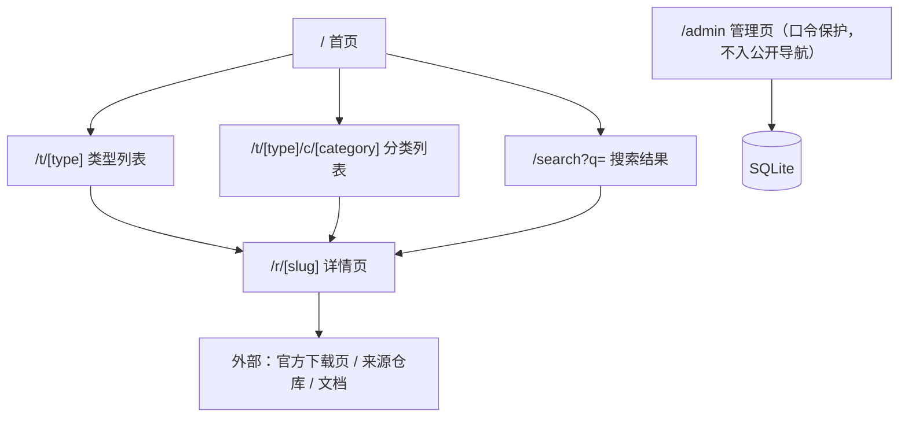

# aihub UI/UX 方案 v1（RUYI-71 阶段 2b）

| 项 | 值 |
|---|---|
| 版本 | v1（2026-09-05，初版） |
| 作者 | 黄小云（设计） |
| 适用端 | Web 响应式（桌面 ≥1024 + 移动 375 两档锚点布局）；移动 App / PC 客户端不在本期 |
| 目标页面 | 首页、分类/筛选列表（含搜索结果）、详情页（获取动作区）、搜索与空态、管理页（功能页） |
| 输入 | 需求规格 v1（RUYI-71 评论线程）、Owner 决策 2026-09-05（评论 01a0722e）、`docs/tech-plan-v1.md` |
| 交付物位置 | 本文件；实现标注面向 @ 顾小鱼，可直接定位复现 |
| 待刷新项 | 分类清单语义以谢小婷分类体系 v2 为准（本方案布局不依赖具体分类名，见 §1.2）；品牌名/Logo 上线前由 Owner 定 |

## 1. 设计输入、判断与假设

### 1.1 已锁定的产品口径（不可偏离）

- 公开目录站：无账号、无 UGC、无评论评分；核心链路「浏览 → 搜索 → 详情 → 获取」。
- 三大资源类型为顶层（应用 / SKILL / MCP），**类型与类型下分类均为数据库数据，界面不写死**（tech-plan §2、§3）。
- 分发为 Q3-A 目录模式：站内不托管任何安装包。三类获取动作——应用「跳官方下载页」、SKILL「跳来源下载 + 复制安装说明」、MCP「复制 JSON 配置 / 安装命令」。
- 合规 D1：第三方名称/图标仅识别性引用 + 来源标注 + 免责声明位。D3：外链安全提示。落点见 §9。
- 管理页：单管理员口令保护，功能页，非视觉重点（§3.5）。

### 1.2 设计假设与风险（次要输入缺失，已注明后继续）

| # | 假设 | 风险与回退 |
|---|---|---|
| A1 | 品牌未定名：Header/页脚用文字标「AI 工具集市」占位 + 通用 mark | Owner 定名后仅替换文案与 Logo 资源，不影响布局 |
| A2 | 主色未经 Owner 确认：提案靛蓝 #4F46E5 为基调 | 全部颜色收敛为 token（§4），换主色只改 `--primary` 一处 |
| A3 | 类型下分类的具体清单、条目归属规则（单/多分类）以谢小婷 taxonomy v2 为准 | 本方案所有分类 UI 均按「数据行渲染 + 空集兜底」设计，分类增删不改布局；归属规则仅影响列表页过滤请求参数，不影响视觉 |
| A4 | 条目图标素材未提供 | LetterMark 兜底组件（§5）；后续自动收录管道中按 §10.7 图标规格补素材 |
| A5 | 首版规模精选数百条 | 分页而非无限滚动；出现性能/规模证据后再议 |

## 2. 信息架构与路由



- 路由命名为实现建议（面向 SEO 的语义 URL），顾小鱼可在其闸门内调整，页面结构与入口关系不变。
- `/search` 复用列表页模板，仅标题与空态文案不同；不做独立搜索结果视觉。
- 全局元素：Header（站名 + 类型导航 + 搜索入口）、Footer（免责声明位 + 收录说明 + 备案位预留）。类型导航条目数 = `resource_types` 行数，随数据增减。

## 3. 页面布局

### 3.0 全局框架

桌面 Header（高 64，sticky，白底下 1px 边框）：

```
┌────────────────────────────────────────────────────────────────┐
│ ◆ AI 工具集市   [应用] [SKILL] [MCP]        🔍 搜索资源…   ⌘K   │
└────────────────────────────────────────────────────────────────┘
   ← 站名(占位)    ← 类型导航=数据驱动          ← 输入框 320→400px
```

移动 Header（高 56，sticky）：

```
┌──────────────────────────┐
│ ◆ AI 工具集市         🔍 │   ← 仅站名 + 搜索图标；类型导航不进 Header
└──────────────────────────┘
```

- 类型导航当前项：文字主色 + 底部 2px 指示条（桌面）/ 选中 chip（移动，见各页）。
- 移动搜索：点🔍全屏覆盖层——顶部输入框（自动聚焦，字号 16px 防 iOS 缩放）+「取消」；输入法组合输入期间不触发提交。
- Footer（两档同构，移动纵向堆叠）：免责声明全文（§9.1）+「收录说明」链接 + 备案占位文字（D4 延后，仅留位）。

### 3.1 首页 `/`

桌面（≥1024，内容宽 1200 居中）：

```
│  Header                                                        │
│ ┌──────────────────────────────────────────────────────────┐  │
│ │        找到好用的 AI 资源                                  │  │
│ │   收录应用 · SKILL · MCP，直达官方获取方式                  │  │
│ │        [ 🔍  搜索应用 / 技能 / MCP…        ] (56px 高)     │  │
│ └──────────────────────────────────────────────────────────┘  │  ← Hero：浅色渐变底，仅首页
│                                                                │
│ ┌─ 应用 · 4 项 ──────────────────  查看全部 → ──────────────┐  │  ← 类型区块 × N（数据驱动）
│ │ [官方应用] [辅助工具] [更多分类…]        ← 该类型分类 chips  │  │
│ │ ┌────────┐ ┌────────┐ ┌────────┐                          │  │
│ │ │条目卡   │ │条目卡   │ │条目卡   │   ← 3 列网格，最多 6 条 │  │
│ │ └────────┘ └────────┘ └────────┘                          │  │
│ └──────────────────────────────────────────────────────────┘  │
│ ┌─ SKILL · n ──────┐  ┌─ MCP · n ──────┐                       │
│ │ Footer：免责声明位 │                                            │
```

- Hero 副文案中的「应用 · SKILL · MCP」按类型数据拼接；类型区块数量、名称、accent 色、条目计数全部来自 DB。
- 某类型下 0 条目：该类型区块仍显示（类型名 + 分类 chips + 空态卡「该类型收录整理中」），不出现在导航的说法见 §6.5。
- 区块内条目取该类型最新 6 条（`updated_at` 倒序）；「查看全部」→ `/t/[type]`。

移动 375：

```
┌──────────────────────────┐
│ ◆ AI 工具集市         🔍 │
├──────────────────────────┤
│ 找到好用的 AI 资源          │  ← Hero 压缩为两行 + 搜索框（点击同 🔍 覆盖层）
│ [ 🔍 搜索…               ] │
├──────────────────────────┤
│ (应用)(SKILL)(MCP)(…)  →   │  ← 类型快速锚点 chips，sticky 于 Header 下，横向滚动
├──────────────────────────┤
│ 应用 · 4        查看全部 →  │
│ [官方应用][辅助工具][…] →    │  ← 分类 chips 横向滚动
│ ┌──────────────────────┐  │
│ │ 条目卡（横向：图44+文） │  │  ← 单列列表卡
│ └──────────────────────┘  │
│ …SKILL 区块 / MCP 区块…    │
│ Footer                    │
└──────────────────────────┘
```

### 3.2 分类/筛选列表页 `/t/[type]`、`/t/[type]/c/[category]`、`/search?q=`

桌面：

```
│ 首页 / 应用 / 官方应用                    ← 面包屑 13px
│ 官方应用 · 12 项                          ← H1 24px + 计数
│ ┌──────────────────────────────────────────────┐
│ │ 分类:  [全部] [官方应用*] [辅助工具] [教育] …  │  ← 分类 chips = 该类型下 categories（数据驱动，数量可变）
│ │ 标签:  [官方产品] [第三方辅助] [免费] [开源] …  │  ← 属性标签过滤（数据驱动词表，可多选；语义以 taxonomy v2 为准）
│ ├──────────────────────────────────────────────┤
│ │ ┌──────┐ ┌──────┐ ┌──────┐                   │
│ │ │条目卡 │ │条目卡 │ │条目卡 │    3 列           │
│ │ └──────┘ └──────┘ └──────┘                   │
│ │            ‹ 1 2 3 ›   每页 24                │
│ └──────────────────────────────────────────────┘
```

- 搜索结果页同模板：H1 换为「“{关键词}” 的搜索结果 · N 项」，chips 区替换为「清除关键词 ×」+ 结果类型分布 chips（可选，P2）。
- 过滤即 URL 参数（`?cat=&tag=&page=`），可分享、可回退；筛选变更重置 page=1。
- 移动 375：单列卡片；筛选 chips 各占一行横向滚动（吸顶跟随 Header）；分页按钮 ≥44px 高。

条目卡（两档同构，移动为横向紧凑变体）：

```
┌──────────────────────────────┐
│ ┌──┐  豆包        [官方产品]  │  ← 图标48/LetterMark · 名称16px粗 · 属性标签
│ │图│  字节跳动旗下的 AI 助手…   │  ← 简介 14px，2 行截断
│ └──┘  应用 · 官方应用           │  ← 类型 badge（accent 底色）+ 分类名 12px
└──────────────────────────────┘
```

- 整卡可点（详情），hover：边框变 accent 色 + 轻投影上浮 2px；键盘 focus 同 hover 视觉 + 焦点环。

### 3.3 详情页 `/r/[slug]` 与获取动作区（核心）

桌面：双栏（主内容 2/3 + 侧栏元信息 1/3，≥1024）；移动单列。

```
│ 首页 / 应用 / 豆包
│ ┌──┐  豆包  [官方产品] [Windows][macOS][Web]      ← 图标64 + 名称30 + 标签组
│ └──┘  字节跳动旗下的 AI 助手，支持…
│ ┌──────────────── 获取 ────────────────────────┐
│ │ ■ 应用类：                                    │
│ │ [ 前往官方下载 ↗ ]   ← 主按钮，下注目标域名      │
│ │ 将跳转至 doubao.com（官方站点）。本站不托管安装包。│  ← D3 提示行 13px
│ │ ■ SKILL 类（替换上方）：                        │
│ │ [ 获取技能包 ↗ ]（跳来源仓库）  域名注示          │
│ │ 安装说明 ────────────────────────              │
│ │ ┌────────────────────────────────┐复 制        │
│ │ │ 1. 下载技能包并解压到 Agent skills 目录…       │  ← 代码块，等宽 13px
│ │ └────────────────────────────────┘             │
│ │ ■ MCP 类（替换上方）：                          │
│ │ MCP 配置 ────────────────────────              │
│ │ ┌────────────────────────────────┐ [复制配置]  │
│ │ │ { "mcpServers": { … } }        │             │  ← 最小高 120，超过内部滚动
│ │ └────────────────────────────────┘ [复制命令]  │  ← 有安装命令时显示
│ │ [ 查看文档 ↗ ]                                  │
│ └───────────────────────────────────────────────┘
│ 简介 / 安装说明（长文区）        │ 侧栏：分类、属性标签 │
│                                │ 收录时间、更新时间    │
│                                │ 来源与官方链接（外链） │
│ Footer（免责声明）                                                │
```

- 获取动作区按条目 `resource_type` 渲染三者之一，组件名 `AcquisitionPanel`（三类各一子组件，见 §6.3 交互规格）。
- 来源标注（D1）：动作区内固定一行「来源：{来源站名} · 信息以官方页面为准」。
- 移动 375：按钮全宽堆叠（主按钮在上）；代码块横向滚动，右上角复制按钮吸着不滚出；元信息折叠为两列键值对置于动作区下方。

### 3.4 搜索与空态（视觉见 §6.4/§6.5）

- 入口：Header 搜索框（桌面）/ 覆盖层（移动）/ 首页 Hero 搜索框。提交式搜索（Enter/点放大镜），实时联想不做（MVP 不做项）。
- 空态、加载骨架、错误态为全局统一组件，规格见 §6.5。

### 3.5 管理页 `/admin`（功能页，非视觉重点）

- `/admin/login`：居中卡片，口令输入 + 提交；错误时输入框红边 + 行内提示「口令错误」；无验证码（本机访问）。
- `/admin`：系统 token 复用，无品牌装饰。顶部条（站名 + 退出）+ 工具条（关键词过滤 + 类型/状态筛选 + 「新建条目」主按钮）+ 表格：

```
│ 名称      类型   分类      状态      更新时间     操作              │
│ 豆包     应用   官方应用  ●已上架    09-05 23:00  编辑·下架·删除    │
```

- 编辑表单（页内展开或抽屉，开发定）：字段 = 数据模型 §3（name/slug/type/category(s)/summary/tags/official_url/source_url/install_guide/icon/status）；必填 name、type、official_url（URL 格式校验，行内报错）；slug 自动生成可改，重复时报「已存在」。
- 状态：提交成功 toast「已保存」；下架/删除二次确认（删除提示不可恢复）；提交中按钮 loading 禁点；列表 loading 骨架行。
- `<meta name="robots" content="noindex">`；入口不进公开导航。

## 4. 视觉规范（Design Tokens）

交付形态：CSS 自定义属性（`:root` 一次定义）；顾小鱼选择 Tailwind / CSS Modules 均可，但**视觉值必须与本表一致**。本方案不强制引入任何组件库（§10.2）。

### 4.1 颜色

| Token | 值 | 用途 |
|---|---|---|
| `--primary` / `--primary-hover` / `--primary-active` | `#4F46E5` / `#4338CA` / `#3730A3` | 主按钮、链接、选中态、焦点环（白底对比 6.3:1） |
| `--text-1` / `--text-2` / `--text-3` | `#0F172A` / `#475569` / `#64748B` | 主/次/三级文字（对比均 ≥4.5:1） |
| `--text-disabled` | `#94A3B8` | 仅禁用与装饰 |
| `--bg-page` / `--bg-surface` | `#F8FAFC` / `#FFFFFF` | 页面底 / 卡片与 Header |
| `--border` / `--border-strong` | `#E2E8F0` / `#CBD5E1` | 分隔线 / 输入框边 |
| `--success` / `--warning` / `--error` / `--info` | `#16A34A` / `#D97706` / `#DC2626` / `#2563EB` | 语义反馈（配套 `*-bg` 浅底：`#F0FDF4` / `#FFFBEB` / `#FEF2F2` / `#EFF6FF`） |

**类型 accent 槽位（数据驱动关键）**：资源类型不绑定写死的品牌色，按 `sort` 顺序循环取 6 个预定义槽位（开发可加 `accent_index` 字段显式指定）。每槽位三元组保证对比达标：

| 槽位 | solid | bg-tint | text-strong |
|---|---|---|---|
| 1 蓝（建议=应用） | `#2563EB` | `#EFF6FF` | `#1D4ED8` |
| 2 紫（建议=SKILL） | `#7C3AED` | `#F5F3FF` | `#6D28D9` |
| 3 绿（建议=MCP） | `#059669` | `#ECFDF5` | `#047857` |
| 4 琥珀 | `#D97706` | `#FFFBEB` | `#B45309` |
| 5 玫红 | `#E11D48` | `#FFF1F2` | `#BE123C` |
| 6 青 | `#0891B2` | `#ECFEFF` | `#0E7490` |

用法：badge = tint 底 + strong 文字；hover 边框/图标 = solid。新增第 7 个类型自动回到槽位 1，无需设计介入。

### 4.2 字体与字号

- 字族：`-apple-system, "PingFang SC", "Microsoft YaHei", "Noto Sans SC", sans-serif`；代码：`ui-monospace, SFMono-Regular, Consolas, monospace`。
- 字阶（px / 行高）：30/1.25（页面 H1）、24/1.3（区块标题）、20/1.4（条目名·详情）、16/1.5（卡片名·按钮）、14/1.6（正文·默认）、13/1.5（辅助·代码）、12/1.5（标签·meta）。
- 移动端所有 `input/textarea` 字号固定 **16px**（防 iOS 聚焦自动放大）。
- 数字用 `font-variant-numeric: tabular-nums`（计数、时间）。

### 4.3 几何与层次

- 圆角：`--radius-sm 6`（标签/chips）、`--radius-md 10`（输入框/卡片/LetterMark）、`--radius-lg 14`（弹层）、full（圆形按钮）。
- 间距 4px 基网：4/8/12/16/20/24/32/40/48/64；卡片内边距 16（移动 12）；区块纵向间距 40（移动 32）。
- 投影：`--shadow-sm 0 1px 2px rgba(15,23,42,.06)`（卡片默认）、`--shadow-md 0 4px 12px rgba(15,23,42,.10)`（hover/弹层）。
- 动效：150ms（hover/按下）、200ms（弹层/覆盖层），`ease-out`；全局响应 `prefers-reduced-motion`（降为无过渡）。
- 内容最大宽 1200，两侧 padding 24（移动 16）。

## 5. 组件清单与状态矩阵

新增组件（均无现成体系可复用——本项目为绿地）：`AppHeader`、`AppFooter`、`TypeNav`、`SearchBox`、`Chip`（分类/标签/选中三态）、`ResourceCard`、`LetterMark`（图标兜底：取名称首字符，accent tint 底 + strong 色，字号 20/图标 48·44·64 三档）、`AcquisitionPanel`（app/skill/mcp 三变体）、`CodeBlock`（含复制）、`CopyButton`、`ExternalLink`（强制 `target="_blank" rel="noopener nofollow"` + ↗ 图标，见 §9.3）、`Badge`、`Pagination`、`Skeleton`（卡片/列表行/详情三种）、`EmptyState`、`ErrorState`、`Toast`、`ConfirmDialog`（admin 用）。

状态矩阵（走查与验收以此为对照）：

| 组件 | default | hover | focus-visible | active | disabled | loading | error | 成功反馈 |
|---|---|---|---|---|---|---|---|---|
| Button-primary | primary 底白字 | primary-hover | 2px 焦点环 offset 2 | primary-active + 缩放 .98 | 灰底 `#E2E8F0` 灰字 | 内联 spinner + 文案不变 | —（表单错误在字段层） | — |
| SearchBox | 320px 边框 | 边框加深 | 边框 primary+焦点环 | — | — | 提交后跳转由路由级骨架承接 | — | — |
| Chip | 白底边框 | 边框加深浅灰底 | 焦点环 | — | — | — | — | 选中=tint 底 strong 字 + 边框 solid |
| ResourceCard | 白底 border | 边框 accent + shadow-md | 同 hover+焦点环 | — | — | Skeleton 占位 | — | — |
| CopyButton | 边框按钮「复制」 | 浅灰底 | 焦点环 | — | — | — | toast「复制失败」红 | 图标换✓+文案「已复制」2s（§6.3） |
| ExternalLink | 带↗图标 | 下划线 | 焦点环 | — | — | — | — | — |
| Pagination | 页码钮 32px | 浅灰底 | 焦点环 | — | 当前页反色禁点；无上/下页时禁用 | — | — | — |
| Toast | — | — | — | — | — | — | 红（失败） | 绿底 `--success-bg`「已复制/已保存」 |
| Input(admin) | 白底边框 | — | 边框 primary | — | 灰底 | — | 红边 + 行内 13px 错误文案 | — |

## 6. 关键交互规格

### 6.1 搜索

1. 触发：Enter 或点击放大镜；`/search?q={encodeURIComponent(kw)}`；空关键词提交 = 回列表态不报错。
2. IME 安全：`compositionstart/end` 期间 Enter 只确认候选词，不提交（中文输入核心场景，走查必测）。
3. 结果页关键词回填搜索框并选中（便于改写）；「清除关键词」→ 返回 `/`。
4. 搜索域：name/summary/tags（实现按 tech-plan SQLite LIKE 起步）；结果按相关度不敏感排序（updated_at 倒序）即可，MVP 不做权重。

### 6.2 筛选

- 分类 chips 单选（含「全部」）；属性标签多选（AND 语义，若 taxonomy v2 定义 OR 语义则以 v2 为准，交互形态不变）。
- 任一筛选变更：URL 替换（`router.replace` 不留历史栈）+ 重置分页；列表区骨架 150ms 内不闪（SSR 场景自然满足，仅提示实现意图）。
- 筛选组合无结果 → 空态含「清除全部筛选」按钮。

### 6.3 获取动作（三类，验收核心）

| 类型 | 主动作 | 次动作 | 复制内容 |
|---|---|---|---|
| 应用 | `ExternalLink` 主按钮「前往官方下载 ↗」→ `official_url` | 「访问官网」文字链（同 URL 时隐藏） | 无 |
| SKILL | 「获取技能包 ↗」→ `source_url` | 安装说明代码块（`install_guide`） | 复制安装说明全文 |
| MCP | 「查看文档 ↗」→ `source_url`（有则显示） | 配置 JSON 代码块；有安装命令再一块 | 复制配置 / 复制命令 |

- **复制反馈**：点击 → `navigator.clipboard.writeText` 成功 → 按钮文案变「已复制 ✓」（tint 底 success 色）+ toast「已复制到剪贴板」，2000ms 后复原；失败或非安全上下文（http）→ 降级 `document.execCommand('copy')` → 仍失败则 toast「复制失败，已为您选中文本，请 Ctrl+C」（代码块内容自动 `select()`）。焦点保持在按钮上，复原不打断读屏。
- 按钮防抖：复制中 800ms 内忽略重复点击。
- 外链提示（D3）：主按钮正下方固定 13px 灰字「将跳转至 {域名}（{官方站点/来源仓库}）。本站不托管安装包，请遵循目标站点条款。」——**持久可见，不做阻断式弹窗**（目录站高频跳转，弹窗伤转化；免责以持续展示 + 页脚声明覆盖，见 §9）。

### 6.4 搜索框细节

- 桌面 Header 内宽 320px，聚焦展开至 400px（transition width 150ms）；`⌘K / Ctrl+K` 全局聚焦（实现便利，P2 可砍）。
- 移动覆盖层：背景 `--bg-page` 95% 不透明 + 轻模糊；出现 200ms；「取消」关闭并还原 URL。

### 6.5 空态 / 加载 / 错误（全局统一）

| 场景 | 视觉 | 文案草案 | 动作 |
|---|---|---|---|
| 搜索无结果 | 插画位（64px 灰放大镜线性图标，不引插画资源）+ 主文案 | 「没有找到“{kw}”相关资源」+「换个关键词，或浏览下方分类」 | 热门分类 chips（数据驱动取条目最多的 3 个分类）+ 清除关键词 |
| 分类下 0 条目 | 同组件 | 「该分类收录整理中」 | 「浏览全部分类」→ `/t/[type]` |
| 类型下 0 条目（首页区块内） | 空态卡 | 「该类型收录整理中，敬请期待」 | 无 |
| 全站 0 条目（DB 空） | 居中空态 | 「资源入库筹备中」 | 管理员提示去 /admin（仅 admin 会话显示该引导） |
| 加载 | 骨架屏：卡片=图块+两行文（呼吸动效，reduced-motion 时静态灰块）；路由级 300ms 内不显示（避免闪烁） | — | — |
| 请求错误 | ErrorState | 「加载失败，请稍后重试」 | 「重试」按钮 |
| 404 | 空态变体 | 「页面不存在或已下架」 | 「回首页」+ 搜索框 |
| 下架条目直达 | 404 同款文案「该资源已下架」 | — | 「浏览同类资源」→ `/t/[type]` |

空态/错误统一不出现裸报错、不白屏；所有空态插画位用图标 + 文案实现，不引外部插画素材（与 A4 一致，后续可为空态定制插画，走查时以「图标级」为验收基线）。

## 7. 响应式断点与极端内容

- 断点：`<768` 移动布局（375 锚点验收）；`768–1023` 桌面布局 2 列卡；`≥1024` 桌面布局 3 列卡 + 双栏详情。320px 不破损（内容可横向滚动区仅限代码块）。
- 极端内容约束：分类名 ≤8 字（超长省略号 + title 提示，admin 录入提示该建议）；条目名 1 行截断；简介 2 行截断；MCP JSON 无长度上限——代码块最小高 120、最大高 360 内部滚动 + 「展开」切换；类型数量增长 → 导航横向滚动（桌面）/锚点 chips 滚动（移动），布局不变；条目 1–3 条时网格左对齐不留拉伸空位。
- 多语言：本期仅中文（zh-CN，`<html lang="zh-CN">`）；文案不写死在组件里，集中放置便于后续抽取。
- 触控目标：移动端所有可点元素 ≥44×44（chips 32 高但扩大热区 padding 8）。

## 8. 可访问性（验收基线）

- 对比度：正文 ≥4.5:1（token 已按此选值，见 §4.1）；大字（≥18.66px 粗体）≥3:1。
- 键盘：全站 Tab 可达，`focus-visible` 焦点环（primary 2px offset 2）；搜索结果、卡片为链接语义（`<a>`）；复制按钮 `aria-live="polite"` 播报「已复制」。
- 图像：条目图标 `alt="{名称} 图标"`；LetterMark 为文本节点无需 alt；装饰性图标 `aria-hidden`。
- 外链统一带「（在新窗口打开）」的 `aria-label` 后缀；chips 用 `aria-pressed`；筛选区 `role="group"` + `aria-label`。
- 动效尊重 `prefers-reduced-motion`。

## 9. 合规设计落点（D1 / D3）

1. **免责声明位（D1）**：Footer 固定全文（草案，最终口径 Owner/谢小婷定稿）：
   「本站为第三方 AI 资源信息聚合目录。页面所涉产品名称、Logo、商标仅用于识别性引用，版权归原作者及权利人所有；条目信息均来自公开渠道，请以官方页面为准。本站不托管、不重分发任何安装包；跳转外部站点后请自行遵循其服务条款与安全提示。」
2. **来源标注（D1）**：详情页获取动作区内固定「来源：{来源名} · 信息以官方页面为准」；卡片属性标签「官方产品/第三方辅助」与实际相符性由 admin 录入侧保证（验收标准 11 条）。
3. **外链安全提示（D3）**：全站外链只经 `ExternalLink` 组件输出（`target="_blank" rel="noopener nofollow"` + ↗ 图标 + 域名注示，§6.3）；不做阻断弹窗的理由与替代方案见该节。

## 10. 实现注意事项（给 @ 顾小鱼）

1. **数据驱动红线**：类型/分类/标签词表一律渲染自 DB，组件内禁止硬编码数组；`resource_types`、`categories` 为空集时走对应空态而非报错；分类增删改只动数据不改前端发版。
2. **样式载体**：token 以 CSS variables 交付（§4）；是否用 Tailwind 由你在脚手架闸门内定，视觉值不得偏离本文件；不因实现引入与视觉规范冲突的默认组件样式。
3. **路由**：§2 建议路由为提案；列表过滤走 URL 参数（可分享可回退）；分页服务端渲染（SEO），每页 24。
4. **搜索**：SQLite LIKE 起步；注意 §6.1 IME 组合输入处理。
5. **复制**：`navigator.clipboard` + execCommand 降级 + 选中兜底（§6.3）；非 https 本机部署属常见场景，降级路径必须真实可用。
6. **外链**：统一 `ExternalLink` 组件（§9.3），禁止散写 `<a target=_blank>`。
7. **图标素材规格**（供后续插图管道）：128×128 WebP/PNG，透明底，安全边距 8px；DB `icon` 存 URL，空值走 LetterMark。
8. **SEO**：详情/列表页 SSR + title 模板「{条目名} - {站名}」、description 取 summary 前 80 字；admin noindex；结构化数据（`SoftwareApplication`）P2 可选不做。
9. 骨架屏用 Next.js `loading.tsx` 路由级实现；空态组件注意 §6.5 各场景映射。

## 11. 范围边界

**本期做**：§2–§9 全部（含管理页最小视觉）。
**本期明确不做**（后续版本评估）：暗色主题（token 已预留扩展）、搜索实时联想与高亮、条目收藏/推荐/相关条目、多语言、账号与 UGC、PWA、复杂动效与插画体系、暗黑模式。

## 12. 设计走查清单（QA 基线，金小欣执行时逐项打勾）

执行条件：同页面、同种子数据、桌面 1440×900 与移动 375×812（等价渲染需标注）两档。

| # | 项 | 页面 | 档 | 通过标准 |
|---|---|---|---|---|
| 1 | 类型导航=DB 数据 | 全站 | 双档 | 增/删一个类型行后导航随之变化，无硬编码残留 |
| 2 | 分类 chips=DB 数据 | 列表页 | 双档 | 同上（分类行增删即变） |
| 3 | 首页类型区块完整 | 首页 | 双档 | 每类型显示名称/计数/分类 chips/最新 6 条/查看全部 |
| 4 | 首页 0 条目类型 | 首页 | 双档 | 区块显示空态卡不消失、不报错 |
| 5 | 375 全流程·浏览 | 首页→列表 | 375 | 单列卡、chips 可横滚、无横向溢出 |
| 6 | 375 全流程·搜索 | 全站 | 375 | 🔍→覆盖层→输入→提交→结果页，IME 组合输入 Enter 不误提交 |
| 7 | 375 全流程·详情 | 详情 | 375 | 字段齐全，动作区按钮全宽可点 |
| 8 | 375 全流程·获取 | 详情 | 375 | 三类条目各完成一次获取动作 |
| 9 | 获取·应用 | 详情 | 双档 | 新窗口打开官方下载页 + 域名注示 + D3 提示行 |
| 10 | 获取·SKILL | 详情 | 双档 | 跳来源 + 安装说明代码块可复制且内容完整 |
| 11 | 获取·MCP | 详情 | 双档 | 复制配置/命令成功，粘贴可用 |
| 12 | 复制反馈 | 详情 | 双档 | 按钮变「已复制 ✓」+ toast，2s 复原；失败路径选中兜底生效 |
| 13 | 搜索命中 | 搜索 | 双档 | 「豆包」可搜到种子条目 |
| 14 | 搜索空态 | 搜索 | 双档 | §6.5 空态 + 热门分类 chips + 清除关键词 |
| 15 | 筛选组合空态 | 列表 | 双档 | 空态含「清除全部筛选」且功能有效 |
| 16 | 属性标签过滤 | 列表 | 双档 | 官方/辅助过滤结果正确（对照 admin 数据） |
| 17 | 加载骨架 | 全站 | 双档 | 路由切换显示骨架，无白屏闪烁 |
| 18 | 404 / 下架直达 | 任意 | 双档 | §6.5 对应空态与引导按钮 |
| 19 | 外链组件一致性 | 全站 | 双档 | 所有外链带 ↗、新窗口、noopener nofollow（可查 DOM） |
| 20 | 免责声明位 | Footer | 双档 | §9.1 全文完整展示 |
| 21 | 键盘可达 | 全站 | 桌面 | Tab 顺序合理，焦点环可见，复制有 aria-live 播报 |
| 22 | 对比度 | 全站 | 双档 | 抽检 text-1/2/3、primary、badge 配色 ≥4.5:1 |
| 23 | reduced-motion | 全站 | 桌面 | 系统开启后无过渡动效 |
| 24 | 管理页最小流程 | admin | 桌面 | 登录错误提示 / 新建校验 / 上下架确认 / 保存 toast |
| 25 | 种子 7 项信息完整 | 详情 | 双档 | 字段集齐全（对照验收标准第 5 条） |

## 13. 变更点、不变项与验收映射

- 相对现状：全为新增页面，无存量视觉兼容问题；「不变项」即 §1.1 锁定口径（数据驱动分类、目录模式、无账号、合规落点），实现不得偏离。
- 验收标准映射：覆盖页面全集→§2–§3；375 全流程→§3.1–3.3 + 走查 5–8；三类获取动作→§3.3/§6.3 + 走查 9–12；空态与外链提示→§6.5/§9 + 走查 14–20；分类数据驱动→§1.1/§10.1 + 走查 1–2。
